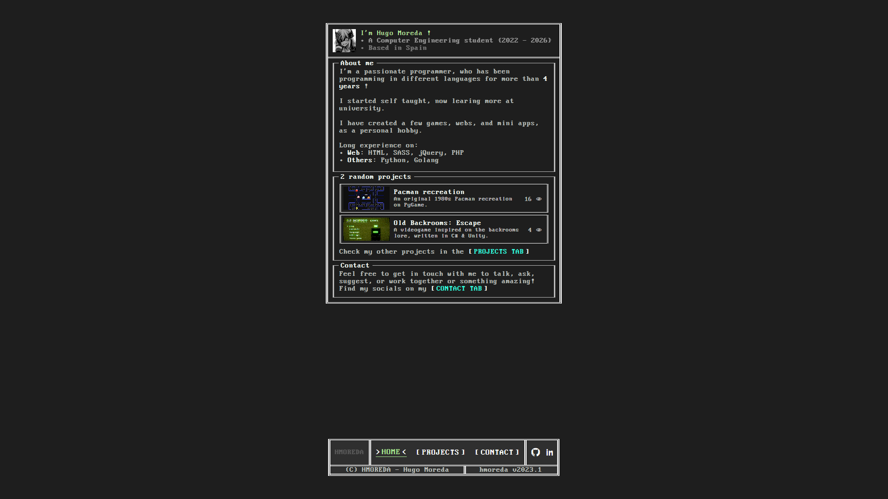
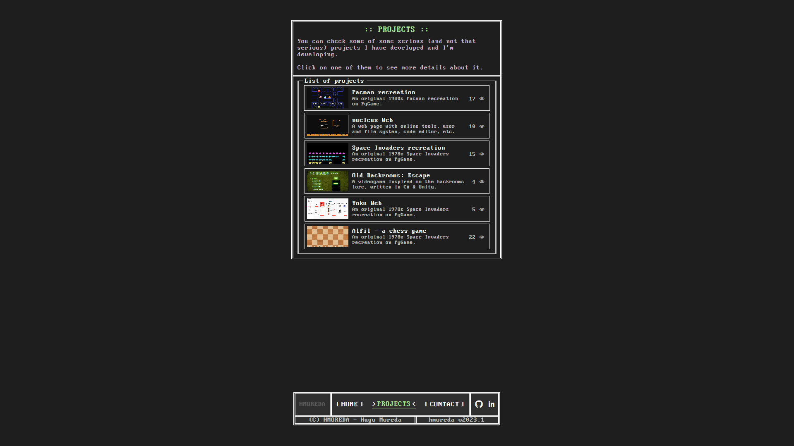
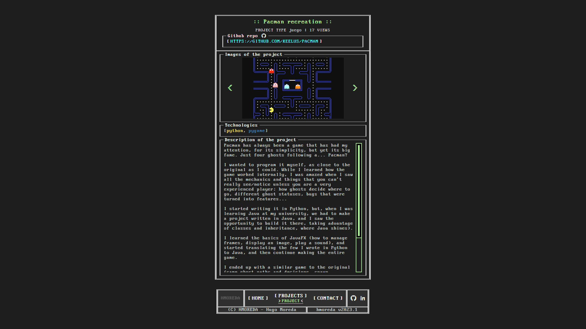

# Personal Portfolio
In development.
## Description
This project serves as my web portfolio, showcasing my work and providing information about me. It mainly includes the following pages: Index, Projects, and Contact.

## Technologies
- Back-end: [Go](https://go.dev/) (go1.20.4) and [Gin web framework](https://github.com/gin-gonic/gin) (v1.9.1).
- Database: SQLite.
- Front-end: HTML, JavaScript/jQuery, and Sass.

## Screenshots

*Index page*
  

*Proyects page*
  

*A project page*
  

*Contact page*
  
