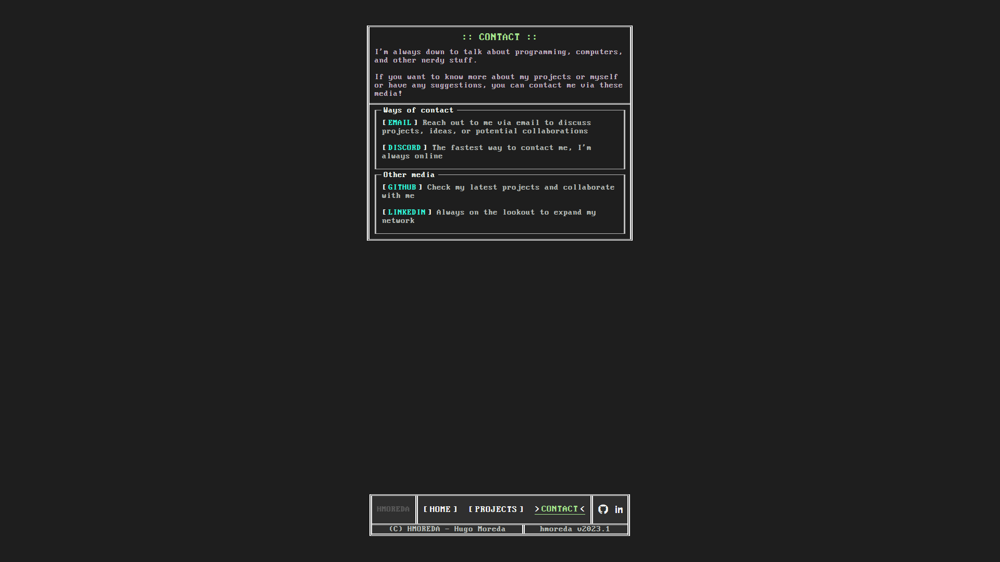

# Personal Portfolio
In development.
## Description
This project serves as my web portfolio, showcasing my work and providing information about me. It mainly includes the following pages: Index, Projects, and Contact.

## Technologies
- Back-end: Go programming language and Gin web framework.
- Database: SQLite.
- Front-end: HTML, JavaScript/jQuery, and Sass (SCSS).

## Screenshots

*Index page*
  

*Proyects page*
  

*A proyect page*
  

*Contact page*
  
